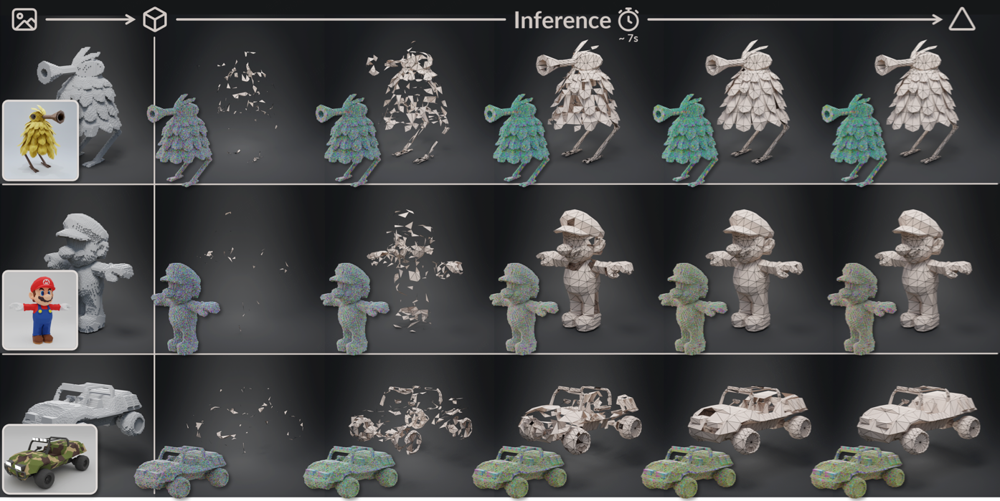

# LATO: 3D Mesh Flow Matching with Structured TOpology Preserving LAtents

<div align="center">

[](https://tianhaozhao668.github.io/LATO/)
[](https://arxiv.org/pdf/2603.06357)
[](https://huggingface.co/udbbdh/LATO)

</div>




## 🌟 Overview
LATO introduces a novel topology-preserving latent representation by natively compressing mesh topology into a structured latent space. Unlike traditional implicit methods that rely on post-hoc isosurface extraction (e.g., Marching Cubes) and autoregressive model, LATO ensures high-fidelity generation of explicit meshes with effieient topological connectivity.

By modeling the mesh as a Vertex Displacement Field (VDF) anchored on the surface geometry, we successfully map dense explicit signals into a differentiable, topology-aware latent space. Our framework enables:
- 🧩 Topology-aware mesh representation
- 🔗 Explicitly decodes connectivity
- 📉 Memory-Efficient training bypasses $O(N^2)$ complexity
- ⚡ Generates artistic meshes in seconds


## 🔥 News

[2026-05-14] Initial Release:
  - Pretrained VAE model weights ($512^3$ reconstruction)
  - Inference scripts and examples
  - LATO implementation

[2026-05-01] 🎉🎉 Our paper was received by ICML2026.


## 🚀 Quick Start

### Installation

1. Clone the repository:

```bash
git clone https://github.com/TianhaoZhao668/LATO.git
cd LATO
```

2. Install dependencies:

```bash
# 1. Create conda environment
conda create -n lato python=3.10.20 -y
conda activate lato
python -m pip install --upgrade pip setuptools wheel packaging ninja

# 2. Install system libraries required by open3d :
sudo apt-get update
sudo apt-get install -y libgl1 libglib2.0-0

# 3. Install the pinned Python dependencies:
pip install -r requirements.txt

# 4. Install flash-attn wheel and install:
wget https://github.com/Dao-AILab/flash-attention/releases/download/v2.6.3/flash_attn-2.6.3+cu118torch2.4cxx11abiFALSE-cp310-cp310-linux_x86_64.whl
pip install flash_attn-2.6.3+cu118torch2.4cxx11abiFALSE-cp310-cp310-linux_x86_64.whl 
```


### Download Checkpoint

Download the released LATO 512 VAE checkpoint from [Hugging Face](https://huggingface.co/YOUR_ORG/LATO) or:

```bash
hf download udbbdh/LATO \
  checkpoints/128to512/vae/vae_128to512.pt \
  --local-dir . \
  --local-dir-use-symlinks False
```


### Running Inference
Basic reconstruction can be:
```bash
python scripts/infer_vae_512.py \
  --mesh assert/sample/test.obj \
  --checkpoint checkpoints/lato-vae-512/lato_vae_512.pt \
  --config configs/infer_vae_512.yaml \
  --output outputs
```


## 📊 Technical Details
LATO Architecture & Pipeline:

- **Input**: Active voxels, point clouds with position, normal and VDF
- **Encoder**: Sparse transformer for efficient topologt compression
- **Decoder**: Decoding vertex and edge using prune head and connection head
- **Output**: Topological 3D meshes


## 🙏 Acknowledgements

Our work builds upon these excellent repositories:

- [TripoSF](https://github.com/VAST-AI-Research/TripoSF) 
- [TRELLIS](https://github.com/Microsoft/TRELLIS)


## 📝 Citation

If you find LATO useful in your research, please consider citing:

```bibtex
@article{zhao2026lato,
  title={LATO: 3D Mesh Flow Matching with Structured TOpology Preserving LAtents},
  author={Zhao, Tianhao and Zhang, Youjia and Long, Hang and Zhang, Jinshen and Li, Wenbing and Yang, Yang and Zhang, Gongbo and Hladk{\`y}, Jozef and Nie{\ss}ner, Matthias and Yang, Wei},
  journal={arXiv preprint arXiv:2603.06357},
  year={2026}
}
```

